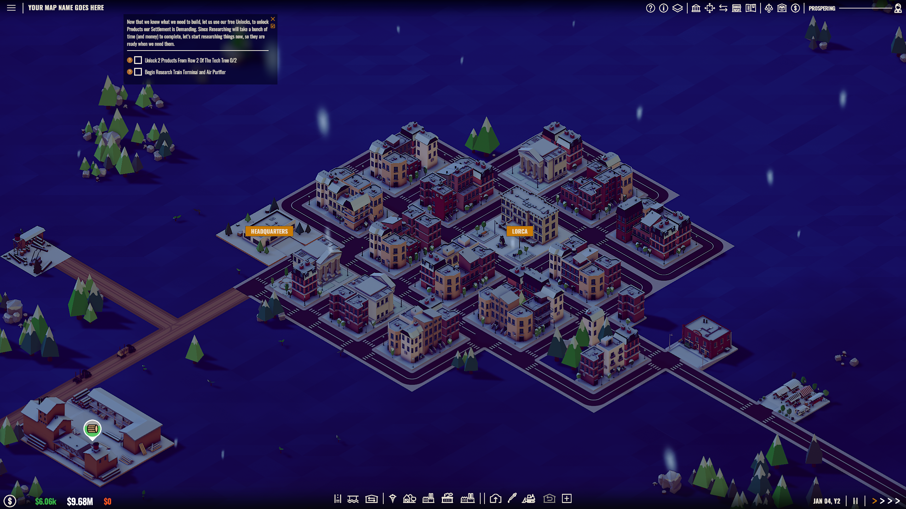
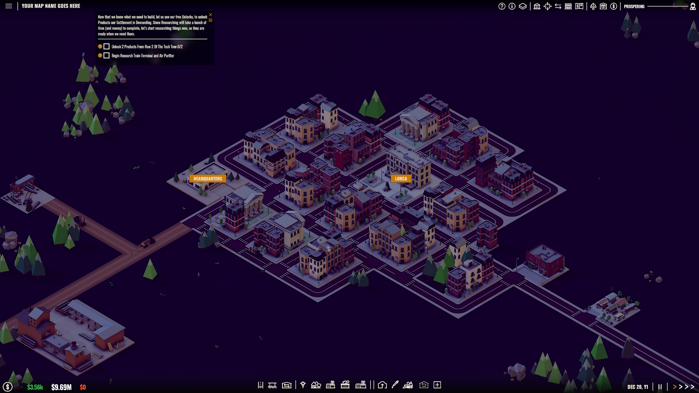

# Rise of Industry - Always Night Mod

A native, zero-overhead visual mod for *Rise of Industry* that permanently sets the game's lighting to a nighttime atmosphere.

> **Tested on Game Version:** `2.3.3 : 0507b*` (Steam - Public)

## Screenshots

## Features
- Forces the main directional light (Sun) to a low-intensity, cinematic moonlight blue color.
- Adjusts the global `RenderSettings` (ambient light and reflections) to perfectly match the nighttime environment.
- Native IL code injection using `Mono.Cecil` guarantees perfect stability, with zero loading screen freezes.

> ⚠️ **Disclaimer:** Because this mod drastically lowers the ambient and directional light to create a nighttime atmosphere, raw natural resources in the world (like oil and coal) will blend into the terrain and become barely visible. Luckily, you can easily use the game's built-in labels and resource overlays to find them!

## Installation
1. Ensure your game is closed.
2. Run `build.ps1` to compile the hook and apply the patch to your game's `Assembly-CSharp.dll`.
3. (A backup of your original DLL is automatically created as `Assembly-CSharp.dll.bak` in your game's Managed folder, in case you ever want to revert).
4. Launch the game and enjoy the night!

If the game updates and overwrites the mod, simply run `build.ps1` again.
